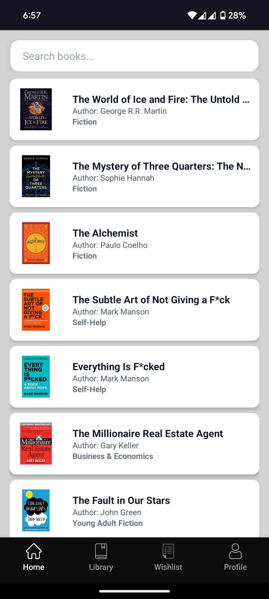
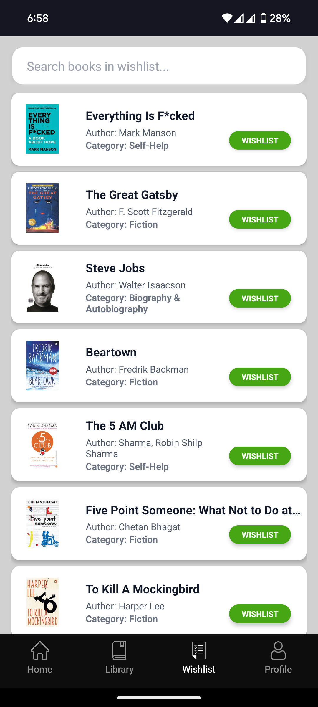
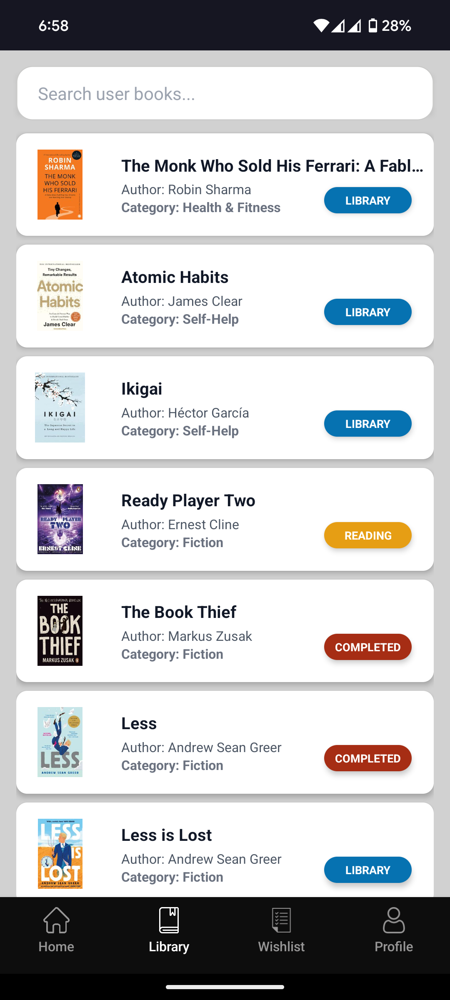

# 📚 Book Tracker App (Breeze)

A React Native-based Book Tracking Application that helps users manage and keep track of their personal reading journey. Users can explore a global library of books, build their own personal library, wishlist titles for later, and monitor what they are currently reading or have finished.

📱 **Download the Android App**  
You can try the app by downloading the latest APK directly:

➡️ [**Download APK**](./assets/apk/breeze-application-v1.5.apk) *(Click to download and install on your Android device)*

> 💡 Make sure to allow installation from unknown sources on your device.

## 🚀 Features

- 🌍 **Global Library View**  
  Browse a vast collection of books available to all users.

- ➕ **Add to Personal Library**  
  Add books from the global view to your own library for easier tracking.

- 💖 **Wishlist**  
  Mark books you're interested in but haven't started yet.

- 📖 **Currently Reading**  
  Keep track of books you're actively reading.

- ✅ **Read Books**  
  Maintain a history of books you've completed.

- 🔍 **Search and Filter**  
  Easily find books by title, author, or category.

- 📱 **Mobile-Friendly UI**  
  Clean, responsive design built with React Native.

## 🛠️ Tech Stack

- **Frontend:** React Native (with Tailwind CSS)
- **Navigation:** React Navigation
- **State Management:** Context API / Redux (optional)
- **Backend (Optional):** SpringBoot Framework, MySQL (Database)
- **API Integration:** Open Library API / Google Books API (customizable)
- **Authentication:** Appwrite

## 🌐 Free Services for Production

> - 🌱 [**Render**](https://render.com/) – For deploying the Spring Boot backend application  
> - 🐬 [**Aiven Console**](https://console.aiven.io/) – For hosting the MySQL database (with free trial credits)  
> - 📱 [**Expo**](https://expo.dev/) – For building and running the React Native Android application
> - [**Backend Repository**](https://github.com/ShrayankM/breeze) - SpringBoot Repository for Backend Application

## 📸 Screenshots

### 🏠 Global Library

### 💖 Wishlist

### 📖 Currently Reading

### ✅ Personal Library

