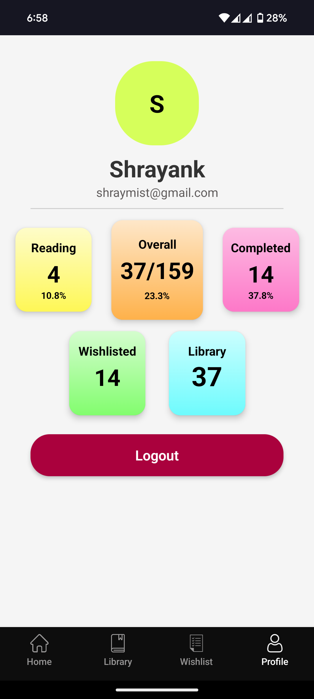

# 📚 Book Tracker App (Breeze)

A React Native-based Book Tracking Application that helps users manage and keep track of their personal reading journey. Users can explore a global library of books, build their own personal library, wishlist titles for later, and monitor what they are currently reading or have finished.

## 🚀 Features

- 🌍 **Global Library View**  
  Browse a vast collection of books available to all users.

- ➕ **Add to Personal Library**  
  Add books from the global view to your own library for easier tracking.

- 💖 **Wishlist**  
  Mark books you're interested in but haven't started yet.

- 📖 **Currently Reading**  
  Keep track of books you're actively reading.

- ✅ **Read Books**  
  Maintain a history of books you've completed.

- 🔍 **Search and Filter**  
  Easily find books by title, author, or category.

- 📱 **Mobile-Friendly UI**  
  Clean, responsive design built with React Native.

## 🛠️ Tech Stack

- **Frontend:** React Native (with Tailwind CSS)
- **Navigation:** React Navigation
- **State Management:** Context API / Redux (optional)
- **Backend (Optional):** SpringBoot Framework, MySQL (Database)
- **API Integration:** Open Library API / Google Books API (customizable)
- **Authentication:** Appwrite

## Free Services for Production
> **Render** (For SpringBoot Application deployment)
> **Aiven Console** (For MySql Database)
> **Expo** (For React Native Android application)

## 📸 Screenshots

### 🏠 Global Library


### 💖 Wishlist


### 📖 Currently Reading


### ✅ Finished Books


> *(Add screenshots of your app here)*  
> Example:
> - 
> - 
> - 
> - 
> - 

## 📦 Installation

```bash
git clone https://github.com/your-username/book-tracker-app.git
cd book-tracker-app
npm install
npx expo start
